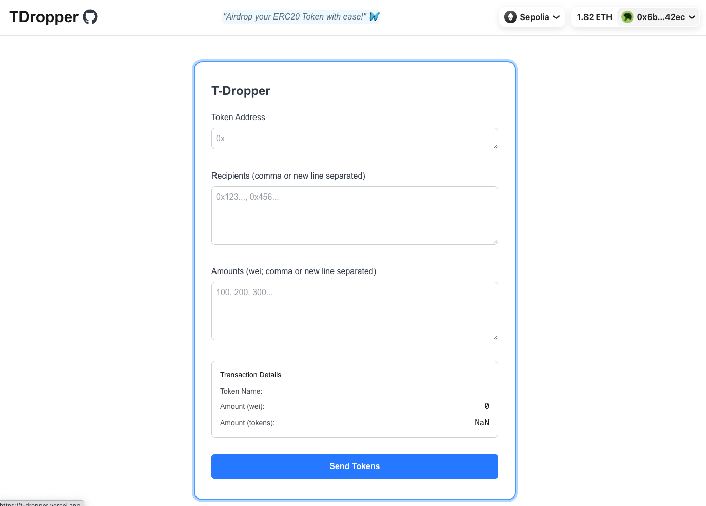

# T-Dropper

**T-Dropper** is a full-stack decentralized application for airdropping ERC20 tokens to multiple recipients. Built with **Solidity (Foundry)** for smart contracts and **Next.js** for the frontend, it allows seamless, gas-efficient token distributions via a secure and user-friendly web interface.

## Live Demo

👉 [https://t-dropper.vercel.app/](https://t-dropper.vercel.app/)

## Preview



## Overview

- **Smart Contract:** Airdrops ERC20 tokens to a list of recipients with one-time validation.
- **Frontend:** Built with Next.js and deployed on Vercel, providing a simple interface for inputting recipients and amounts.
- **Wallet Integration:** Users can connect with wallets via RainbowKit.
- **Chain:** Deployed to **Sepolia Testnet** and **local Anvil** chain.
- **Testing:** Includes contract-level tests and component tests using **Vitest**.

## How It Works

1. **Pre-validation:** Users can pre-check recipient addresses and amounts using `isValidRecipientsAndAmounts` to avoid gas waste.
2. **Airdrop Execution:** Once validated, the `airdropERC20` function performs the token transfer to all recipients in a single transaction.
3. **Gas Optimization:** Separating validation from execution avoids redundant checks.

## Smart Contracts

The project includes a single main smart contract:

### `TDropper.sol`

- Handles batch ERC20 token airdrops.
- Uses `SafeERC20` for secure transfers.
- Key features:
  - Validation function to pre-check recipients and amounts.
  - Custom errors for clear reverts.
  - Protects against zero addresses, mismatched arrays, and incorrect totals.

## Frontend

- **Framework:** Next.js (static export mode)
- **Wallets:** RainbowKit + wagmi (using viem under the hood)
- **Deployment:** [Vercel](https://vercel.com/)
- **Testing:** Vitest for component testing

### Folder Structure

```
T-Dropper/
│
├── contracts/       # Foundry-based smart contracts
├── ui/              # Next.js frontend
├── screenshot/      # Screenshot images used in README
```

## Tech Stack

- **Smart Contracts:** Solidity (Foundry)
- **Frontend:** Next.js (React, TypeScript)
- **Wallet Integration:** RainbowKit, wagmi
- **Token Transfer:** OpenZeppelin ERC20, SafeERC20
- **Testing:** Foundry (contracts), Vitest (frontend)
- **Chain:** Sepolia, Anvil

## Setup & Installation

Clone the repository and navigate to desired part:

```bash
git clone https://github.com/yourusername/tdropper.git
cd tdropper
```

To run the contracts:

```bash
cd contracts
forge install
forge test
```

To run the frontend:

```bash
cd ui
pnpm install
pnpm dev
```

## Deployment

- **Contracts:** Deployed to Sepolia and local Anvil network
- **Frontend:** Deployed on Vercel → [https://t-dropper.vercel.app](https://t-dropper.vercel.app)

## Author

Built by **0xdef4**
